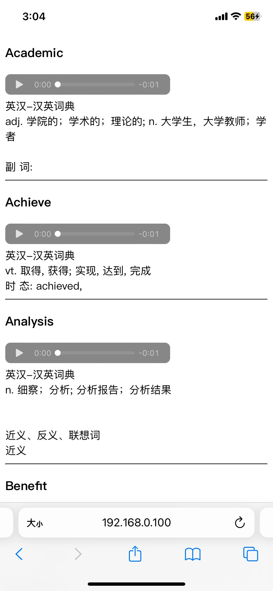

### IELT 雅思单词
长久以来记单词的方法是记住单词字母的排列和与之相映射的中文语义，但是我们知道语言先于文字出现，说明相对于文字的记忆，人类更愿意在学语言的过程中构建一套语音系统。比如一个很普遍的现象，老外学中文中很容易学会说，但不一定会写汉字。所以我在想能不能提供一个相较于传统单词书更注重单词发音的记忆单词工具，如下图，通过不断点击播放单词音频强化听和说的肌肉记忆来实现单词的记忆。
